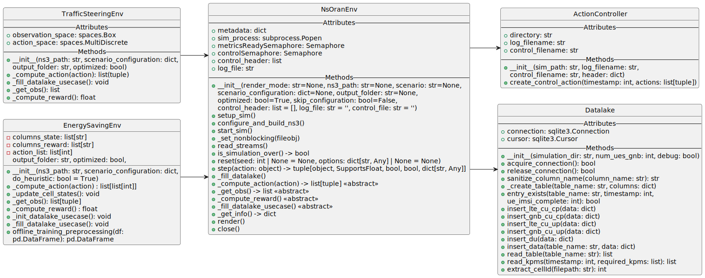

# A Gymnasium Environment for ns-O-RAN

This repository contains a package for a [gymnasium](https://gymnasium.farama.org/) based reinforcement learning environment for the 5G O-RAN architecture through the [`ns-O-RAN`](https://openrangym.com/ran-frameworks/ns-o-ran) simulator.

## Installation

Clone the repository

```
hatch build
pip3 install dist/*.tar.gz
```

A published version of the package is available:

```
pip3 install nsoran
```

## An overview

At a high level: the system can be viewed through its different parts:

+ The `base` folder contains the abstract class `NsOranEnv`, as well as the two utility classes: `ActionController` and `Datalake`. `NsOranEnv` deals with the communication with the agent and the underlying simulation, `ActionController` writes the agent's action to a file shared with the simulation and `Datalake` acts as a wrapper to an *SQLite* database used to store the *KPMs* (*Key Performance Metrics*).
+ The `environments` folder contains `TrafficSteeringEnv` and `EnergySavingEnv`, environments derived from `NsOranEnv`, implementing the Traffic Steering and Energy Saving use case

The primary goal of this work is to provide a Gymnasium-compliant environment for 5G Open RAN online reinforcement learning. To accommodate a wide range of use cases, we have developed `NsOranEnv`, an abstract environment that serves as the foundational building block for all new environments. `NsOranEnv` coordinates both the environment and the ns-3 simulation, offering several utilities as well. This structure simplifies the creation and testing of new environments, as the complexities of ns-3 and its simulations are managed by the existing `NsOranEnv`.

Briefly, every new environment that is built on NsOranEnv should provide a json file to the constructor (`scenario_configuration`) that will be used to fetch the necessary information for the environment to work. Of course, this json can be fine tuned to provide the necessary parameters for any specific new environment. Moreover, each newly created environment should include the following methods, which are require by `NsOranEnv`:

+ `_get_obs()`: returns the observation state;
+ `_compute_reward()`: computes the reward;
+ `_compute_action()`: converts the agent’s action defined in gym into the format required by ns-O-RAN,

Additionally, `_init_datalake_usecase()` and `_fill_datalake_usecase()`  may be implemented to capture additional data from ns-O-RAN and store it in the Datalake.
A full example can be found on `EnergySavingEnv`, which extends `NsOranEnv` for the O-RAN Energy Saving use case. For specific details on how each abstract method should be extended by new environments see the `docs/` and `CITATION.cff`.



## References

If you are interested in ns-O-RAN and its usare here are some useful links:

+ ns-o-RAN framework presentation: <https://openrangym.com/ran-frameworks/ns-o-ran>
+ Journal about Traffic Steering with ns-O-RAN: <https://ieeexplore.ieee.org/document/10102369>
+ Tutorial OSC RIC version E ns-O-RAN connection: <https://www.nsnam.org/tutorials/consortium23/oran-tutorial-slides-wns3-2023.pdf>
+ Tutorial Colosseum RIC (i.e., OSC RIC bronze reduced) ns-O-RAN: <https://openrangym.com/tutorials/ns-o-ran>
+ Recording of the tutorial OSC RIC version E done at the WNS3 2023: <https://vimeo.com/867704832>

If you use the Gymnasium Base Environment, please reference the following paper:

```text
@INPROCEEDINGS{10619796,
  author={Lacava, Andrea and Pietrosanti, Tommaso and Polese, Michele and Cuomo, Francesca and Melodia, Tommaso},
  booktitle={2024 IFIP Networking Conference (IFIP Networking)}, 
  title={Enabling Online Reinforcement Learning Training for Open RAN}, 
  year={2024},
  volume={},
  number={},
  pages={577-582},
  keywords={Training;Cellular networks;Open RAN;Computer architecture;Software;Quality of experience;Telemetry;Open RAN;ns-3;deep reinforcement learning;artificial intelligence;gymnasium},
  doi={10.23919/IFIPNetworking62109.2024.10619796}}
```

If you use ns-O-RAN without the Gym Environment, please reference the following paper:

```text
@inproceedings{10.1145/3592149.3592161,
author = {Lacava, Andrea and Bordin, Matteo and Polese, Michele and Sivaraj, Rajarajan and Zugno, Tommaso and Cuomo, Francesca and Melodia, Tommaso},
title = {ns-O-RAN: Simulating O-RAN 5G Systems in ns-3},
year = {2023},
isbn = {9798400707476},
publisher = {Association for Computing Machinery},
address = {New York, NY, USA},
url = {https://doi.org/10.1145/3592149.3592161},
doi = {10.1145/3592149.3592161},
booktitle = {Proceedings of the 2023 Workshop on Ns-3},
pages = {35–44},
numpages = {10},
keywords = {5G, O-RAN, Open RAN, RIC, ns-3, simulation},
location = {Arlington, VA, USA},
series = {WNS3 '23}
}
```

If you use the TrafficSteering Environment, please reference the following paper:

```text
@ARTICLE{10102369,
  author={Lacava, Andrea and Polese, Michele and Sivaraj, Rajarajan and Soundrarajan, Rahul and Bhati, Bhawani Shanker and Singh, Tarunjeet and Zugno, Tommaso and Cuomo, Francesca and Melodia, Tommaso},
  journal={IEEE Transactions on Mobile Computing}, 
  title={Programmable and Customized Intelligence for Traffic Steering in 5G Networks Using Open RAN Architectures}, 
  year={2024},
  volume={23},
  number={4},
  pages={2882-2897},
  keywords={Handover;Computer architecture;Optimization;Base stations;Data models;Protocols;Convolutional neural networks;O-RAN;ns-3;deep reinforcement learning;traffic steering;network intelligence},
  doi={10.1109/TMC.2023.3266642}}
  ```

If you use the EnergySaving Environment with no changes, please reference the following paper:

```text
@INPROCEEDINGS{Bord2501:Evaluation,
AUTHOR="Matteo Bordin and Andrea Lacava and Michele Polese and Sai Satish and Manoj
Ananthaswamy Nittoor and Rajarajan Sivaraj and Francesca Cuomo and Tommaso
Melodia",
TITLE="Design and Evaluation of Deep Reinforcement Learning for Energy Saving in
Open {RAN}",
BOOKTITLE="2025 IEEE 22nd Consumer Communications \& Networking Conference (CCNC)
(CCNC 2025)",
ADDRESS="Las Vegas, USA",
PAGES="5.99",
DAYS=10,
MONTH=jan,
YEAR=2025,
KEYWORDS="Open RAN; 5G/6G; Energy Efficiency; Reinforcement Learning"
}
```

If you make any changes to the EnergySaving Environemnt, please reference the following paper:

```text
@INPROCEEDINGS{Bord2501:Demo,
AUTHOR="Matteo Bordin and Andrea Lacava and Michele Polese and Francesca Cuomo and
Tommaso Melodia",
TITLE="Demo: Enabling Deep Reinforcement Learning Research for Energy Saving in
Open {RAN}",
BOOKTITLE="2025 IEEE 22nd Consumer Communications \& Networking Conference (CCNC)
(CCNC 2025)",
ADDRESS="Las Vegas, USA",
PAGES="1.99",
DAYS=10,
MONTH=jan,
YEAR=2025,
KEYWORDS="Open RAN; Simulation; 5G/6G; Energy Efficiency; Reinforcement Learning"
}
```
